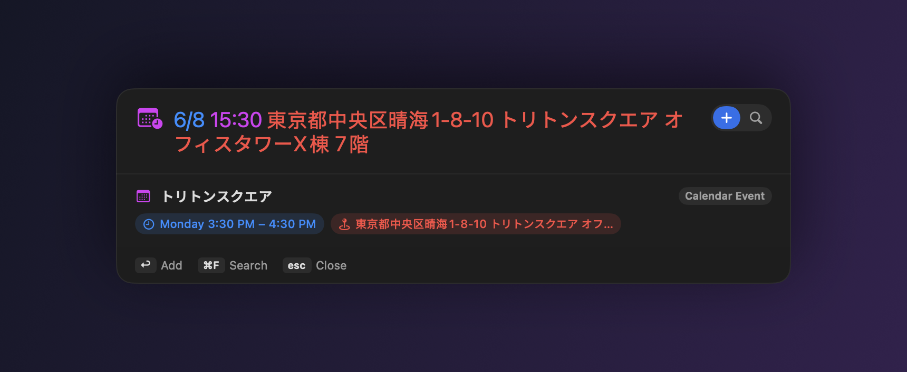
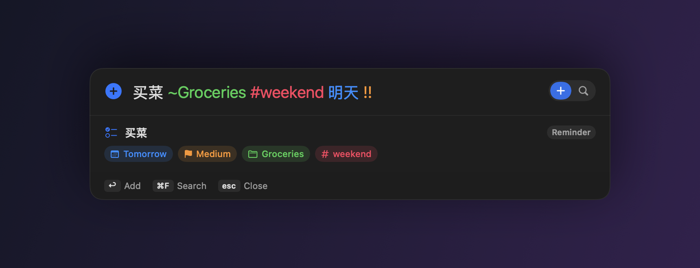
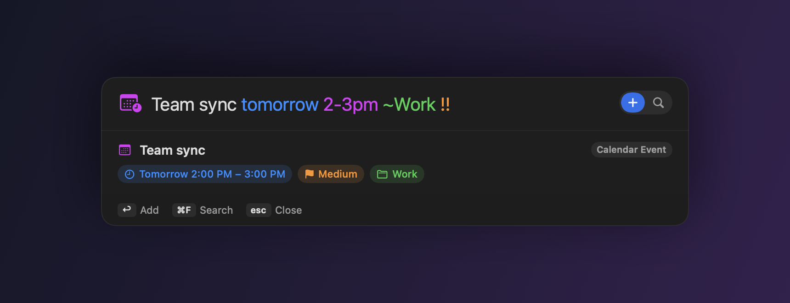
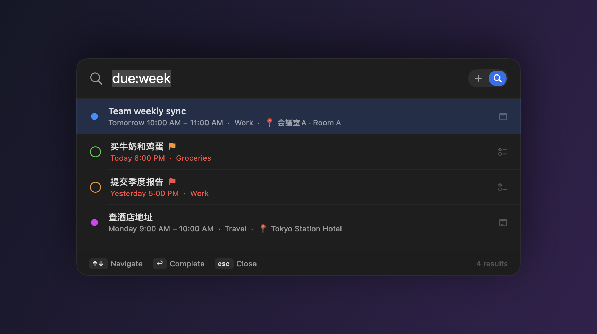
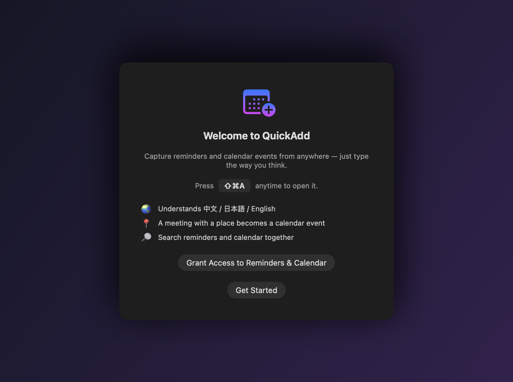

<div align="center">

# ⌘ QuickAdd

### Capture reminders & calendar events from anywhere — one keystroke, natural language, bilingual.

[](https://github.com/ekkkkki/QuickAdd/actions/workflows/ci.yml)
[](LICENSE)




</div>

Press **⇧⌘A** anywhere, type the way you think — `明天下午3点 开会 30min`, `Team sync tomorrow 2-3pm ~Work`,
or just paste a whole address — and QuickAdd decides whether it's a **Reminder** or a **Calendar event**,
pulls out the **time, location, priority, list, tags, and recurrence**, and saves it to Apple Reminders /
Calendar. No app-switching, no forms.

---

## Features

- **Global hot key ⇧⌘A** — a floating quick-add panel drops in over any app (Spotlight-style),
  grabs focus, and returns it when dismissed.
- **Natural-language parsing** (中文 + English), with a **live preview** of how your text will be
  interpreted before you commit.
- **Reminder vs. event, decided automatically**
  - A **time range** (`9am-10am`, `下午3点到4点半`) or a **time + duration** (`3pm 30min`, `9点 1.5h`)
    → a **Calendar event**.
  - A **specific time + a place or a meeting** (`6/8 15:30 東京都中央区晴海1-8-10`, `明天3点开会`)
    → also a **Calendar event**, with the address pulled out into the event's **location**.
  - Otherwise → a **Reminder** (all-day if you only gave a date; timed if you gave a clock time).
- **Bilingual location & meeting detection** (rule-based NLP, JP / 中文 / EN): address & venue
  cues (丁目, 階, タワー, Floor, Room, `1-8-10`, …) and meeting words (会議, 开会, meeting, …).
- **Multi-line input** — paste a whole address block; the field grows instead of clipping.
- Parses **dates, times, durations, ranges, priority, lists, tags, recurrence, URLs, location, notes**.
- **Smart search** across Reminders *and* Calendar with a small filter language
  (`is:event due:week ~Work #urgent !!`), inline complete/delete.
- **Localized UI** — the app's own chrome follows your system language (English / 中文 / 日本語),
  not just the parser.
- **Optional on-device LLM** (Apple Intelligence, macOS 26+) refines fuzzy cases — opt-in,
  private, never required (the rule-based parser always runs).
- Native SwiftUI UI, menu-bar agent (no Dock icon), launch-at-login, configurable default lists.

---

## Screenshots

| Add a reminder | Add an event |
|---|---|
|  |  |

Tokens are color-coded live as you type; the preview shows exactly what will be created.



Smart search across Reminders **and** Calendar — overdue items in red, 📍 locations, per-list colors.

---

## Install

### Option A — build & package locally (recommended)

Requires the Swift toolchain (Xcode or Command Line Tools).

```bash
./package.sh
```

This builds a release binary, assembles `dist/QuickAdd.app`, embeds an icon, ad-hoc code-signs it,
and produces `dist/QuickAdd.dmg`. Then:

```bash
open dist            # drag QuickAdd.app to /Applications
```

Building locally avoids Gatekeeper's quarantine, so the app launches normally.

### Option B — from the DMG

Open `QuickAdd.dmg`, drag **QuickAdd** to **Applications**. Because the app is ad-hoc signed
(not notarized), the first launch needs **right-click ▸ Open** to confirm.

---

## Permissions

On first launch QuickAdd shows a short welcome and asks for **Reminders** and **Calendar** access.
Both are needed to save items. You can re-check or re-grant under **Settings… ▸ Access** (in the
menu-bar menu), or in **System Settings ▸ Privacy & Security**.



The quick-add hot key is **⇧⌘A** by default and can be changed in Settings.

---

## Usage

Click the menu-bar icon, or press **⇧⌘A** anywhere.

| Key | Action |
|-----|--------|
| `↩` | Add the reminder / event |
| `⌘F` | Switch to Search |
| `⌘N` | Switch back to Add |
| `esc` | Close the panel |

### Quick-add syntax

Word order is flexible — put the date/time wherever it reads naturally.

| You type | Result |
|----------|--------|
| `买牛奶` | Reminder, no date |
| `明天下午3点 开会` | Reminder, tomorrow 15:00 |
| `明天下午3点 开会 30min` | **Event** 15:00–15:30 |
| `周五 9am-10am 团队会议` | **Event** with a range |
| `下午3点到4点半 复盘` | **Event** 15:00–16:30 |
| `6/8 15:30 東京都中央区晴海1-8-10`<br>`トリトンスクエア オフィスタワーX棟 7階` | **Event**, address → **location** (paste multi-line) |
| `明天3点 和张总在星巴克见面` | **Event** (meeting keyword) |
| `30分钟后 提醒喝水` | Reminder in 30 min |
| `in 2 hours call mom` | Reminder in 2 hours |
| `每周一 上午10点 周会` | Repeating reminder, weekly on Monday |
| `3月5日 交报告` | All-day reminder (rolls to next year if past) |
| `2026-12-31 年终总结` | All-day reminder on a date |
| `买菜 ~Groceries #home !!` | High-priority reminder in *Groceries*, tag *home* |
| `写周报 // 本周进展和下周计划` | Reminder with notes after `//` |

**Tokens**

- **Priority**: `!` low · `!!` medium · `!!!` high · or `p1`/`p2`/`p3`
- **List / calendar**: `~ListName` (e.g. `~Work`)
- **Tags**: `#tag`
- **Notes**: everything after ` // ` or a newline
- **Recurrence**: `每天 / daily`, `每周一 / every monday`, `每月 / monthly`, `every 3 days`, …
- **Times**: `下午3点`, `晚上8点半`, `中午`, `3pm`, `3:30pm`, `15:00`, `noon`
- **Durations**: `30min`, `1h`, `1.5h`, `半小时`, `两个小时`, `half an hour`
- **Relative**: `30分钟后`, `2小时后`, `in 30 min`, `in 2 hours`

### Search syntax

Open Search (`⌘F` or the menu). Free text matches titles/notes; filters narrow it down:

| Filter | Meaning |
|--------|---------|
| `is:event` / `is:reminder` | only events / only reminders |
| `is:done` / `is:open` | by completion |
| `due:today` · `due:tomorrow` · `due:week` · `due:overdue` | by due date |
| `~ListName` / `list:Name` | by list / calendar |
| `#tag` | by tag |
| `!!!` / `priority:high` | by priority |

Example: `团队 is:event due:week ~Work`. Click a reminder's circle to complete it; hover a row to delete.

---

## Testing

The parser is the brain, so it has a thorough, deterministic suite (100+ checks). Because the
Command Line Tools toolchain ships neither XCTest nor swift-testing on the SPM path, the suite is a
self-contained runner:

```bash
swift run QuickAddTests          # unit tests: parsing, dates, recurrence, location, search query (118 checks)
.build/debug/QuickAdd --smoke-test          # launch / run-loop boot check
.build/debug/QuickAdd --selftest-ui         # headless UI/layout test (catches input clipping/growth)
QuickAdd --selftest-eventkit                # end-to-end: create → search → delete real items + location round-trip
```

`--selftest-eventkit` needs Reminders/Calendar access; it creates two clearly-labeled
`QuickAdd self-test ✓` items, verifies search finds them, then deletes them.

---

## Architecture

```
Sources/
  QuickAddCore/        Pure logic, no UI/EventKit — fully unit-tested
    Models.swift           ParsedItem, Priority, RecurrenceRule, Highlight
    InputParser.swift      Orchestrates: url → notes → priority → list → tags → recurrence → date → location
    DateTimeParser.swift   Bilingual date/time/duration/range engine (injectable clock)
    LocationDetector.swift Address/venue cues + meeting keywords (JP/CN/EN), event classification
    ChineseNumber.swift    一二三…十 → Int
    SearchQuery.swift      The search mini-language
  QuickAdd/            The macOS app
    main.swift             AppKit bootstrap
    AppDelegate.swift      Menu-bar agent, wiring, self-test modes (--selftest-ui / -eventkit)
    HotKeyManager.swift    Carbon RegisterEventHotKey (⇧⌘A, no Accessibility needed)
    PanelController.swift  Borderless key-able floating panel, top-pinned growth, focus return
    EventKitService.swift  EKEventStore bridge: create (+ location) + search, sequential access prompts
    GrowingTextView.swift  Multi-line NSTextView field that grows then scrolls
    LLMRefiner.swift       Optional on-device FoundationModels refinement (gated, weak-linked)
    PanelModel.swift       Observable state for the panel
    *View.swift            SwiftUI: add, search, settings, components
    UISelfTest.swift       Headless layout assertions
  QuickAddTests/       Self-contained assertion runner (no XCTest dependency)
Packaging/             Info.plist, entitlements, icon generator
package.sh             Build → .app → sign → .dmg
```

The parser keeps the original string and **masks** each recognized span in place, so highlight
offsets stay valid and the leftover text becomes the title. The clock is injectable, which is why
the tests are deterministic.

---

## Notes & limitations

- **Runs on macOS 14+.** Building from source needs the **macOS 26 SDK** (the optional Apple
  Intelligence integration is weak-linked), so run `swift build` / `./package.sh` on macOS 26.
  CI builds and tests only `QuickAddCore`, which has no such requirement.
- Ad-hoc signed for local/personal distribution. For sharing widely you'd add a Developer ID
  signature + notarization in `package.sh`.
- The quick-add hot key defaults to ⇧⌘A and is customizable in **Settings ▸ General**.
- Date parsing favors common phrasings; very unusual constructions fall through to the title
  (nothing is lost — you just see it in the preview and can adjust).
